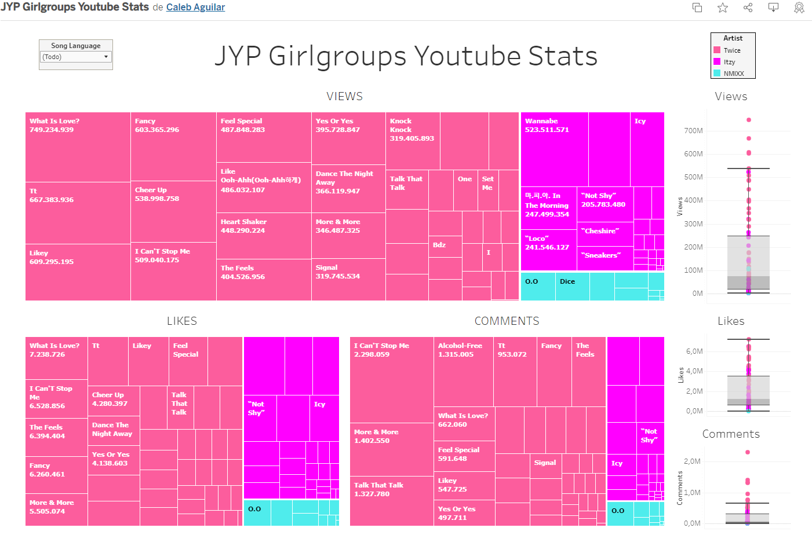
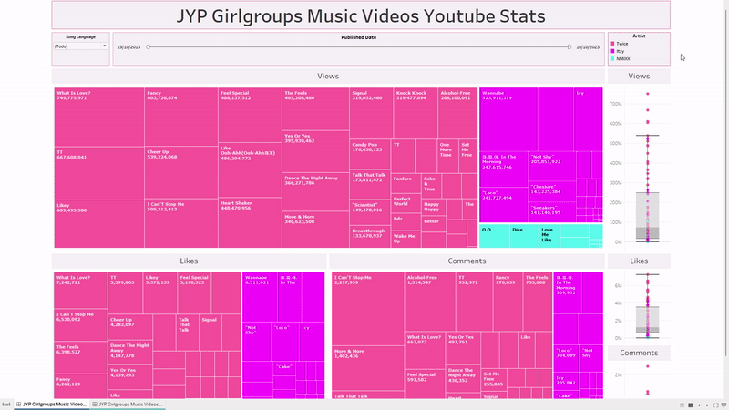
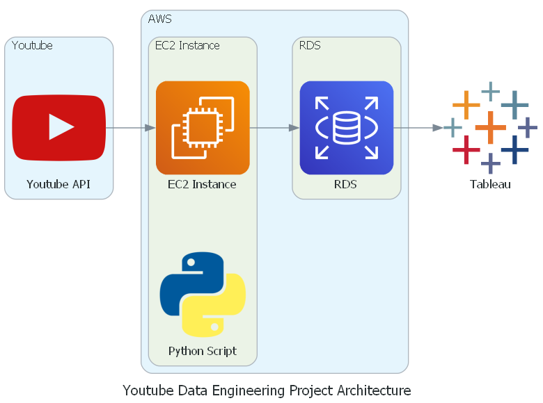

# Youtube Data Engineering Project

## Description

The 'Youtube Data Engineering Project' was conceived from my profound appreciation for the South Korean music group, Twice, and my expertise as a Data Engineer. This project was developed to enrich my portfolio and showcases my skills in data engineering.

I began by exploring the YouTube API using the Google Cloud Console. I gathered detailed information related to music videos by Twice. This required creating a Google Cloud project, activating the API, and obtaining an API key to collect essential data for analysis. Additionally, I expanded the project to include music videos from Itzy and Nmixx, recognizing their value as valuable additions

I carefully planned how to structure the gathered data by choosing a table format for efficient organization. Then, I used the AWS free tier to set up an EC2 instance with an Amazon/Linux 2023 OS. This EC2 instance was methodically configured, installing essential software and libraries required for running a Python script designed for data extraction and storage. The extracted information was systematically stored in an AWS RDS PostgreSQL database. I ensured a strong connection between the EC2 instance and the database to seamlessly transfer and store data, all without incurring any costs.

I used Tableau Desktop to gain a comprehensive understanding of metrics like likes, views, and comments on the music videos. This visual analytics tool enabled the creation of real-time and historical views, facilitating day-to-day analysis of metric trends. To ensure security for my RDS and Tableau environment, I took a cautious approach. I carefully curated a CSV file containing data for a single day, allowing visualization without direct access to RDS. This method enabled sharing the data publicly on Tableau Public, ensuring accessibility while safeguarding the integrity of the main database and visualization platform.

## Things I Learned:
I gained practical experience using Linux and enhanced my knowledge about different Linux distributions, revisited Docker as it had been a while since I last used it.

## Tech Stack

- Python 3.10
    - Pandas
    - google-api-python-client
    - psycopg2-binary
    - diagrams
- SQL (PostgreSQL dialect)
- AWS EC2 with Amazon Linux 2023 (AL2023)
- RDS with PostgreSQL 15.4
- Tableau Desktop 2023.3
- Linux commands

## Dashboard - JYP Girlgroups Youtube Stats

Find the direct link to see the full dashboard in Tableau Public [here](https://public.tableau.com/views/JYPGirlgroupsYoutubeStats/JYPGirlgroupsYoutubeStats?:language=es-ES&:display_count=n&:origin=viz_share_link).

A quick preview of the "Good" Dashboard

## Development Process

To replicate this project, follow the steps [described here](steps/steps.MD).

## Data Architecture

## Possible Improvements

### 1. Expand YouTube API Data Retrieval
Explore gathering more data from the YouTube API to enhance visual representations. Getting additional useful information might make the analysis more informative and engaging when visualizing JYP girlgroup's music videos.

### 2. Enhance Tableau Dashboard
- **Better User Experience (UX) and Design (UI):** Make the Tableau dashboard more user-friendly and visually appealing for easier navigation and better looks.
- **Add Advanced Features:** Consider adding new functionalities, such as linking directly to YouTube videos from the dashboard. To enable this, it might involve including an extra column in the RDS database table containing links to the music videos. Clicking on specific data could then open the corresponding video on YouTube, enhancing accessibility and user experience.

### 3. Improve Security to Database Access
An enhancement in terms of security could involve reevaluating how the Python script accesses the database. Utilizing an AWS service like Secrets Manager could significantly bolster security measures. However, it's crucial to note that this enhancement would incur additional costs, as Secrets Manager is not included in Amazon's free tier of services.

## Licence

This project is under the Apache License 2.0